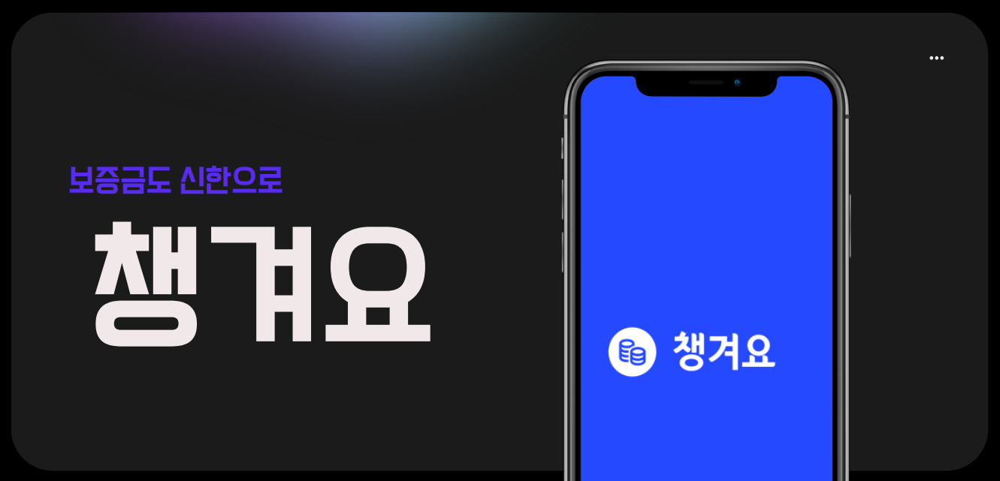

# 보증금도 신한으로, 챙겨요!

# OverView
> 보증금도 신한으로, 챙겨요!

우리 삶의 다양한 곳에는 '보증금 시스템'이 존재합니다. 스키장에서의 장비대여 보증금, 펜션을 빌릴 때의 숙소 보증금 등이 그 예시입니다.

'챙겨요'는 이러한 보증금을 오직 QR 스캔과 한번의 터치로만 간편하게 송금하고, 반환할 수 있도록 도와줍니다.

# Video
썸네일 클릭 시, 챙겨요의 시연영상이 담긴 유튜브 동영상으로 연결됩니다.

# Function
## 간단한 QR 생성 및 공유
- 계좌가 등록되어 있는 상태라면, 간단한 입력 몇번으로 송금 요청 QR을 생성할 수 있습니다.
- QR을 직접 보여주거나, 공유하기 버튼으로 링크를 공유하여 손쉽게 송금을 요청하세요!

## QR 코드를 활용한 간편 송금
- 송금 QR 또는 링크를 전달받았다면, 해당 링크를 통해 단 한번의 터치로 간단하게 송금할 수 있습니다.
- 지정된 사용자(QR 생성자)에게 송금되고, 송금자의 계좌는 외부로 노출되지 않으니까 안심하세요!

## 보증금 단일 반환 / 여러건 반환
- 입금받은 보증금 내역을 확인하고, 돌려줄 때도 '반환' 버튼을 통해 간편하게 돌려주세요!
- 특정 사유로 전액 반환이 어렵다면, 수정된 금액과 사유도 함께 전달해드릴게요.

# Referenced APIs
본 프로젝트는 '2023 하반기 신한은행 해커톤' 참가작으로, 신한은행에서 제공받은 API를 참고하여 자체 은행서버를 구축하였습니다.

- 전체 계좌 목록 조회
- 계좌 잔액 조회
- 계좌 거래내역 조회
- 계좌 인증을 위한 1원 이체 
- 이체 (원화)

# Team
|전인혁|임우택|최영환|홍진식|
|:---:|:---:|:---:|:---:|
|팀장 / FE|BE|BE|BE|
|||||
|[wjs5025](https://github.com/wjs5025)|[Chaos0103](https://github.com/Chaos0103)|[longBright](https://github.com/longBright)|[jinsikhong](https://github.com/jinsikhong)|

# Documents
- [챙겨요_개발기획서](http://naver.me/xxRTG8H8)
- [챙겨요_Figma(Mockup)](http://naver.me/xQ8AVUSt)
- [챙겨요_ERD](http://naver.me/xRPMvRpR)
- [챙겨요_발표자료](http://naver.me/FLhMlqeH)
